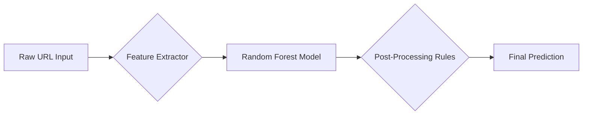

# 🛡️ Phishing URL Detector  
**A real-time phishing URL scanner powered by Machine Learning and Intelligent rule-based analysis.**

---

### 🔥 What It Does

Detects malicious URLs using:
- ✅ A **trained ML model**
- 🧠 **Smart rule overrides** (typo-squatting, brand whitelist, pattern match)
- 📊 Transparent feature breakdowns
- ⚡ Instant feedback via a clean **Streamlit** UI

---

### ⚙️ How It Works
1. User inputs a URL into the app.

2. The app extracts multiple features from the URL like length, number of digits, etc.

3. These features are passed to a pre-trained Random Forest model that predicts whether the URL is safe or phishing.

4. The model’s output is then refined by rule-based checks including:

    - Typo-squatting detection (e.g., g00gle.com)

    - Whitelist matching for known safe domains (e.g., google.com)

    - Suspicious substring patterns (e.g., login-, secure-)

5. The final verdict (phishing or legitimate) is displayed alongside detailed feature info and explanations.

---

### ⚒️ Feature Engineering  
We extract structural features from each URL:
- ✅ HTTPS present?
- 🔢 Number of digits
- ⚠️ Count of special characters (`@`, `-`, etc.)
- 🌐 Domain vs. IP-based host
- 📁 Path depth and length
- 📏 Overall URL length

---

### 🤖 ML Model Performance
The phishing URL detection system is powered by a **Random Forest Classifier** trained on a labeled dataset of legitimate and phishing URLs. The model demonstrates **high accuracy and generalization**, making it well-suited for real-world deployment.

🔍 Metrics Overview

| Metric              | Score     |
|---------------------|-----------|
| Training Accuracy   | 99.59%    |
| Test Accuracy       | 99.55%    |
| Overall Accuracy    | 99.55%    |

---

### 🛡️ Additional Heuristic Checks

Beyond machine learning predictions, the app also performs real-time **heuristic analysis** to catch phishing attempts that might evade standard classifiers:

- 🔤 **Typosquatting detection :** `amaz0n.com`, `faceb00k.net`, etc.
- 🔗 **Suspicious character patterns :** `login-`, `secure-`, `verify-`, etc.
- 🌐 **Known-domain safelist :** real domains like `google.com`, `apple.com`

---

### 🎯 Feature List

The following features were extracted from the urls present in the dataset in order to accurately train the model :

| Feature | Description |
|--------|-------------|
| `length` | Total length of the URL |
| `num_dots` | Number of `.` in the full URL |
| `has_https` | 1 if using HTTPS |
| `has_at` | 1 if `@` exists in domain |
| `has_dash` | 1 if `-` in domain |
| `num_digits` | Count of digits in URL |
| `has_ip` | 1 if domain is an IP |
| `num_subdirs` | Path slash count |
| `hostname_length` | Length of domain |
| `path_length` | Length of path after domain |
| `num_dots_domain` | Dots in the domain part |

---

### 🚀 Quick Test Cases

| Input URL | Expected Verdict | Why |
|-----------|------------------|-----|
| `https://google.com` | ✅ Legitimate | Safe, known brand |
| `https://g00gle.com` | 🚨 Phishing | Typo-squatting |
| `https://secure-login-facebook.com` | 🚨 Phishing | Suspicious pattern |
| `https://facebook.com` | ✅ Legitimate | Safe |
| `https://am122az0n.com` | 🚨 Phishing | Visual deception |
| `http://192.168.1.1/login` | 🚨 Phishing | Raw IP address in URL |

---

### 🧠 Model Pipeline



---

### 🖥️ Local Setup
1. Clone the repo
```bash
git clone https://github.com/yourusername/phishing-url-detector.git
cd phishing-url-detector
```
2. Install dependencies
```
pip install -r requirements.txt
```
⚠️ Make sure the phishing_model.pkl file is present in the project root directory before running the app.

3. Run the streamlit app
```
streamlit run app.py
```

---

### 🗂 Project Structure
```
phishing-url-detector/
├── app.py                 # Streamlit frontend
├── phishing_model.pkl     # Pre-trained ML model
├── PhishingML.ipynb       # Collab notebook used for preprocessing and model training
├── requirements.txt       # Python dependencies
└── README.md              # This documentation
```

---

### 📬 Credits & Acknowledgements
Dataset sourced from [Phishing Websites Dataset on Kaggle](https://www.kaggle.com/datasets/marryjanety/phishing-url-dataset-url-and-label)
  – thanks to the contributors!

---

### 🙈 Disclaimer
This project is for educational and research purposes only.
Always verify suspicious URLs independently and follow cybersecurity best practices.

---

### 👨‍💻 Author
Made by Shreyaa Murali
📧 f20230300@dubai.bits-pilani.ac.in
🐙 GitHub: @shreyaa1811

---

